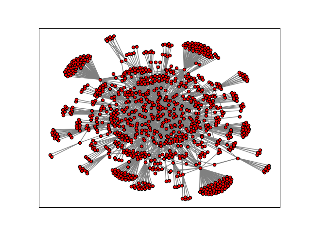

# Immunization Strategy

There are many different strategies for immunizing populations in order to prevent transmission of a virus or an infectious disease with a minimal number of doses.  One such strategy, outlined in [1], is to fragment a population into separate groups via a "separator". This strategy partitions a population into two large groups of similar size and a third separator group. The separator is chosen so that all connections between the two larger groups pass through it, and should be kept as small as possible. In this scenario, removing the separator  from the population disconnects the two large groups, preventing tramission of the infection between the groups. Immunizing the separator then breaks the transmission cycle, and so selecting a separator that contains as few individuals as possible will minimize the number of immunization doses required. In this example, we show how this optimization problem can be implemented using the Ocean SDK and solved using the hybrid discrete quadratic model solver available in Leap.

## Usage

To run the demo, type:

```python demo.py```

Additional options are available to select different graphs to run the problem on. To see the full list of options, type `python demo.py -h`.

During a successful run of the program, two images are produced and saved. The first is the original input graph, saved as `input_graph.png`.



The second highlights the partition of the population into large groups (left and right) and separator (center).


### Graphs Available

Several different types of graphs or networks are available for this demo using the options provided. These are all built using NetworkX graph generator functions, and the details of these functions can be found [here](https://networkx.org/documentation/stable//reference/generators.html#).

- `karate`: Karate Club graph; a fixed graph on 33 nodes.
- `internet`: Internet Autonomous System network; specify nodes between 1,000 and 10,000.
- `rand-reg`: A random d-regular graph; specify number of nodes and value for d.
- `ER`: Erdos-Renyi random graph; specify number of nodes and edge probability.
- `SF`: Barabsi-Albert scale-free graph; specify number of nodes and number of edges to add from a new node to any existing nodes.

## Code Overview

Given a population represented as a graph, the optimization problem can be broken down into the following objective and constraints.

- Objective: Minimize the number of nodes in the separator
- Constraint 1: Large groups have equal size
- Constraint 2: No edges between the large groups

This problem can be modeled as a discrete quadratic model (DQM). We assign a variable for each node in the graph, and each variable has three cases: one for each large group and one for the separator group. A variable can be assigned to exactly one of those three groups.

## References

[1] Chen, Yiping, et al. "Finding a better immunization strategy." Physical review letters 101.5 (2008): 058701.
